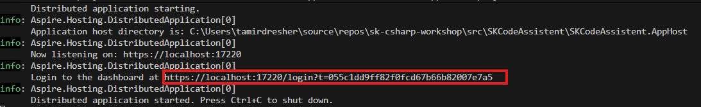
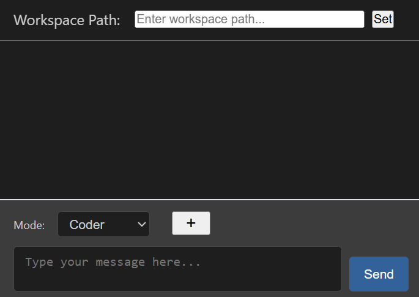
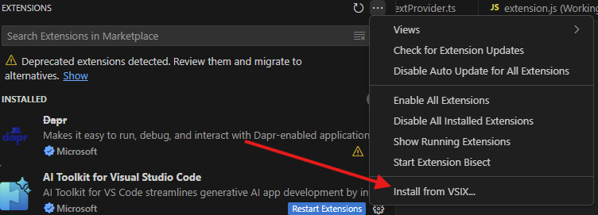
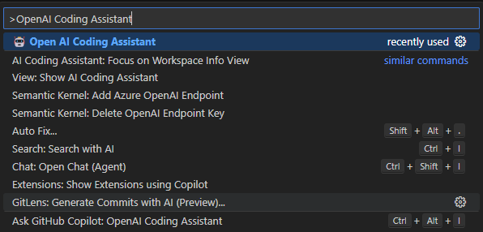

# Creating AI Apps and Agents with C# workshop - Using Semantic Kernel Agents 

## introduction

In this workshop you will learn how to use Semantic Kernel to build applications with AI Agents.
The workshop goal is to build an AI Coding Assistent that could at the end perform a work of a software development team to create or modify a software project.
The workshop is built in way where you extend the functionality of the backend until you reach multi-agent orchestration.

## Components
1. An ASPNET Core Backend service - This hosts you agents and provides a Chat UI page
2. A VSCode extension that integrates with a Backend application and hosts the Chat UI page in VS Code. The extension monitors the active VS Code workspace and updates the backend about the workspace folder and active-document path.
3. [Aspire Host project](../src/SKCodeAssistent/SKCodeAssistent.AppHost) - To start the backend and open the dashboard you should run the Aspire host project 


## 🤖 AI Agents Features

- **🏗️ Architect Agent**: System design, architecture planning, and project structuring
- **💻 Developer Agent**: Code implementation, debugging, and technical execution
- **🧪 Tester Agent**: Quality assurance, testing, and validation
- **🔄 Agent Collaboration**: Multi-agent conversations to accomplish complex tasks
- **📁 Workspace Integration**: Agents work directly with your project files and structure


## 🚀 Quick Start

### Prerequisites
- **.NET 9 SDK** - Required for building and running the project
- **Node.js 18+** - For VS Code extension development
- **.NET Aspire 13.0** - Latest version for cloud-native orchestration
- **Semantic Kernel 1.67.1** - Latest stable version with enhanced agent capabilities
- **AI Model** - Served from Azure OpenAI or GitHub marketplace ([instructions](Using_GitHub_Models.md)). You can also use a local model (With LM Studio, Ollama, Local Foundry etc) but be aware that these will perform well with the complex tasks

### What's New in This Version

**🚀 Updated to Latest Versions:**
- .NET Aspire upgraded from 9.3.1 to **13.0.0**
- Semantic Kernel upgraded from 1.61.0 to **1.67.1**
- All packages updated to latest stable versions

**🆕 New Learning Content:**
- **Agent-to-Agent (A2A) Protocol** - Standardized communication between AI agents
- **Process Framework** - Event-driven business process orchestration
- **Human-in-the-Loop (HITL)** - Patterns for human oversight in AI workflows
- **Guardrails & AI Safety** - Control mechanisms, filters, and safety patterns
- **Additional Orchestration Patterns** - Aggregator, Reducer, Scatter-Gather, Pipeline

**📚 New Notebooks:**
- [Notebook 6: A2A Protocol](../notebooks/6-Agent-to-Agent-Protocol.ipynb)
- [Notebook 7: Process Framework & HITL](../notebooks/7-Process-Framework-and-HITL.ipynb)
- [Notebook 8: Guardrails & AI Safety](../notebooks/8-Guardrails-and-AI-Safety.ipynb)


### Configuration
#### **Configure Model details:**
   [src/SKCodeAssistent/SKCodeAssistent.AppHost/appsettings.json](../src/SKCodeAssistent/SKCodeAssistent.AppHost/appsettings.json)
   ```json
   // In src/SKCodeAssistent/SKCodeAssistent.AppHost/appsettings.json
   {
     "Parameters": {
         // Set these if youre using a model hosted in Azure AI Foundry
         "AzureOpenAIModelId": "",
         "AzureOpenAIEndpoint": "",
         "AzureOpenAIApiKey": "",

         // Use these if youre using a model hosted in GitHub or Locally
         "OpenAIModelId": "",
         "OpenAIEndpoint": "",
         "OpenAIApiKey": ""
      }
   }
   ```


#### **Alternaticly you can set these configs as secrets** 

   Set these if youre using a model hosted in Azure AI Foundry
   ```shell
   cd ../src/SKCodeAssistent/SKCodeAssistent.AppHost
   dotnet user-secrets set "Parameters:AzureOpenAIModelId" "your-model-name"
   dotnet user-secrets set "Parameters:AzureOpenAIEndpoint" "https://your-resource.openai.azure.com/"
   dotnet user-secrets set "Parameters:AzureOpenAIApiKey" "your-api-key"
   ```

   Set these if youre using a model hosted in GitHub or Locally
   ```shell
   cd ../src/SKCodeAssistent/SKCodeAssistent.AppHost
   dotnet user-secrets set "Parameters:OpenAIModelId" "your-model-name"
   dotnet user-secrets set "Parameters:OpenAIEndpoint" "https://your-resource.openai.azure.com/"
   dotnet user-secrets set "Parameters:OpenAIApiKey" "your-api-key"
   ```

## **Run the AI Assistent backend:**

   Open the solution in Visual Studio and run the Aspire Host project [src/SKCodeAssistent/SKCodeAssistent.AppHost/SKCodeAssistent.AppHost.csproj](../src/SKCodeAssistent/SKCodeAssistent.AppHost/SKCodeAssistent.AppHost.csproj)

   Or use the CLI

   ```bash
   dotnet run --project src/SKCodeAssistent/SKCodeAssistent.AppHost/SKCodeAssistent.AppHost.csproj
   ```

   Open the dashboard

   

   OR navigate to https://localhost:50534/

   

## **Run the AI Assistent vs extension:**

1. Install the extension using the [vsix file](../src/extension/vscode-ai-coding-assistant-0.0.1.vsix)



2. In VS Code, open the Command Pallate (using the shortcut ⇧⌘P on macOS or Ctrl+Shift+P on Windows and Linux) and run the command *Open AI Coding Assistant*



### Debugging the VS Code extension

1. **Compile the Extension:**
   ```bash
   cd src/extension
   npm install
   npm run compile
   ```

2. **Test the Extension:**
   - Open this project in VSCode
   - Press `F5` to launch Extension Development Host