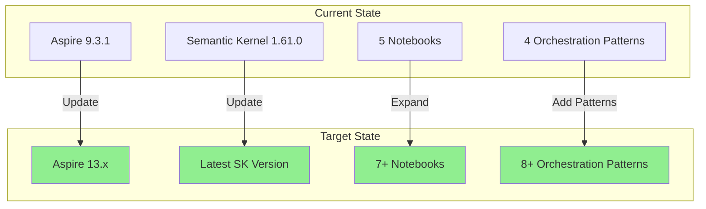
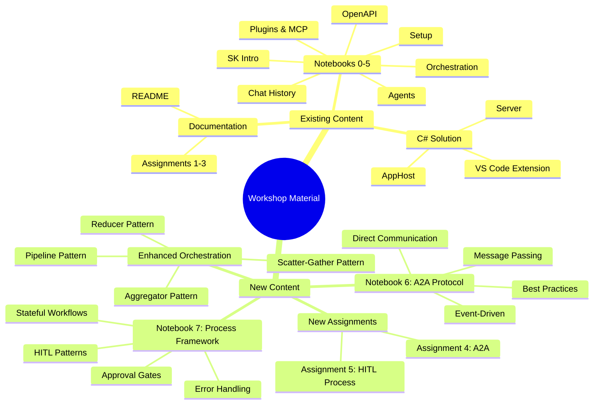
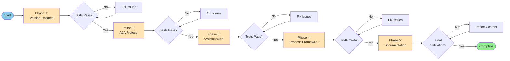
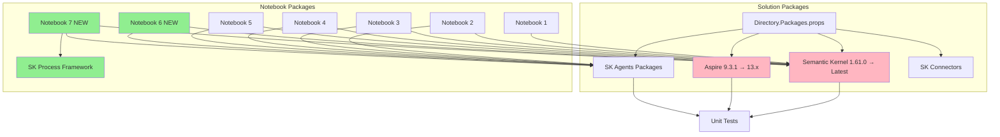
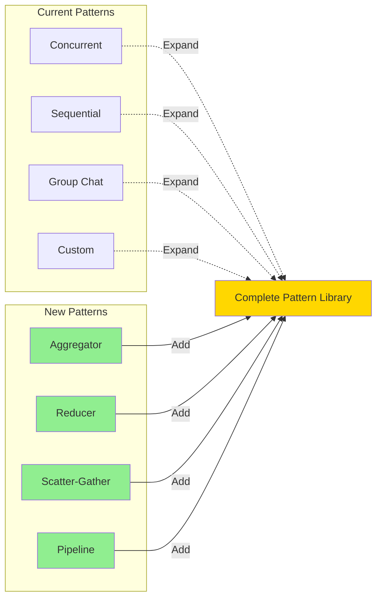
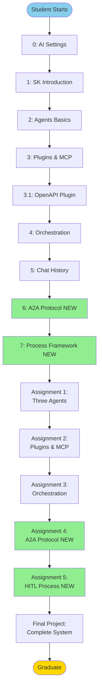
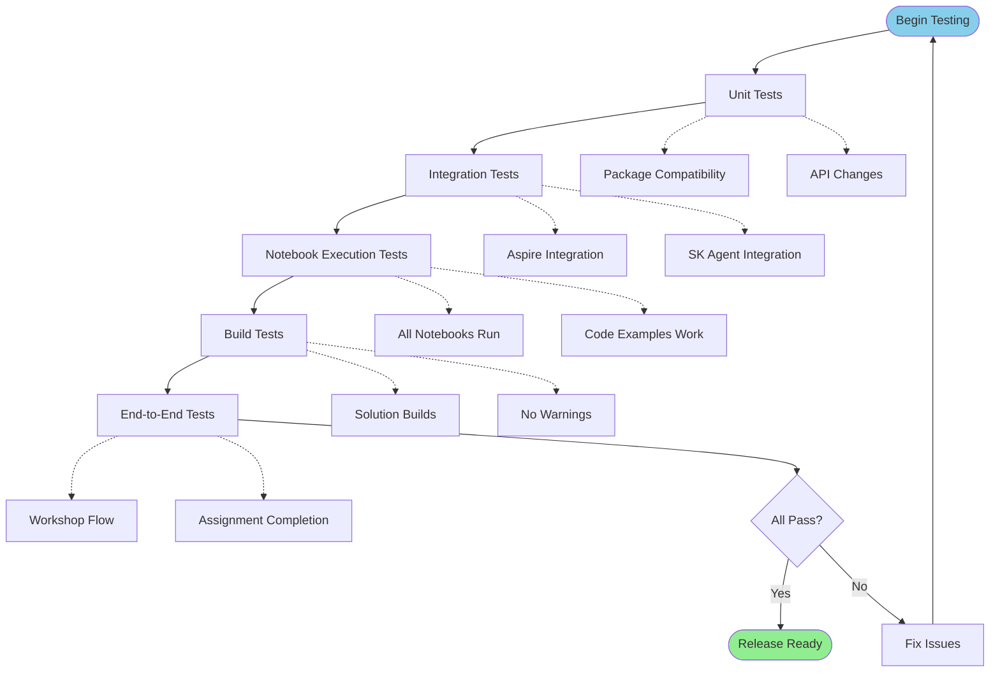
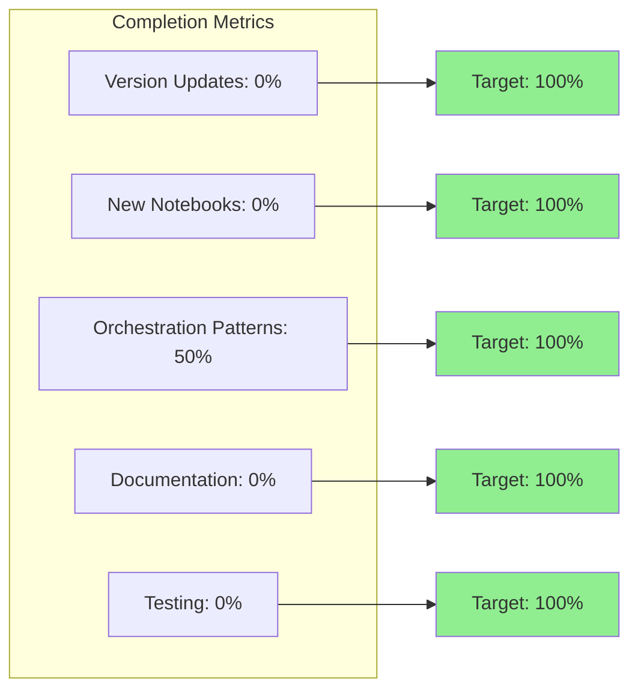
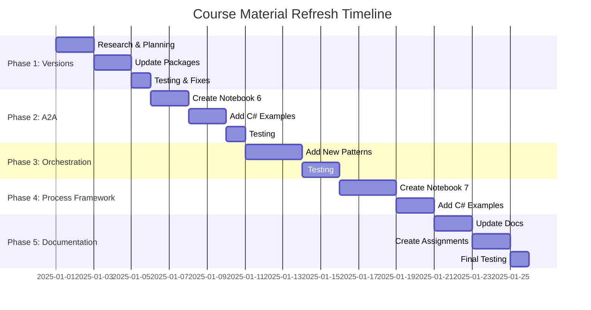

# Course Material Refresh - Architecture Overview

## System Architecture Diagram

## Content Expansion Map

## Update Workflow

## Package Dependency Flow

## Orchestration Patterns Evolution

## Learning Path Integration

## New Content Structure

```mermaid
graph TD
    subgraph "Notebook 6: A2A Protocol"
        A1[Introduction to A2A]
        A2[Core Concepts]
        A3[Implementation Patterns]
        A4[Practical Examples]
        A5[Best Practices]
        A1 --> A2 --> A3 --> A4 --> A5
    end
    
    subgraph "Notebook 7: Process Framework"
        P1[Process Framework Intro]
        P2[Stateful Workflows]
        P3[HITL Introduction]
        P4[HITL Patterns]
        P5[Real-World Example]
        P1 --> P2 --> P3 --> P4 --> P5
    end
    
    subgraph "Enhanced Notebook 4"
        O1[Existing 4 Patterns]
        O2[Aggregator Pattern]
        O3[Reducer Pattern]
        O4[Scatter-Gather Pattern]
        O5[Pattern Comparison]
        O1 --> O2 --> O3 --> O4 --> O5
    end
    
    style A1 fill:#FFE4B5
    style P1 fill:#FFE4B5
    style O2 fill:#90EE90
    style O3 fill:#90EE90
    style O4 fill:#90EE90
```

## Testing Strategy

## Risk Management Matrix

| Risk Level | Area | Mitigation |
|------------|------|------------|
| 🔴 High | Aspire 13 Breaking Changes | Maintain 9.3.1 fallback branch |
| 🟡 Medium | SK API Changes | Early testing, comprehensive docs |
| 🟡 Medium | Notebook Compatibility | Version-pinned examples |
| 🟢 Low | Documentation Updates | Clear change logs |
| 🟢 Low | Assignment Difficulty | Gradual complexity increase |

## Success Metrics Dashboard

## Implementation Phases Timeline

---

*This architecture document provides visual representations of the refresh strategy and serves as a reference throughout the implementation process.*