# Course Material Refresh - Architecture Overview

## System Architecture Diagram

## Content Expansion Map

## Update Workflow

## Package Dependency Flow

```mermaid
graph TD
    subgraph "Solution Packages"
        DP[Directory.Packages.props]
        DP --> SK[Semantic Kernel 1.61.0 → Latest]
        DP --> ASP[Aspire 9.3.1 → 13.x]
        DP --> AGENTS[SK Agents Packages]
        DP --> CONNECTORS[SK Connectors]
    end
    
    subgraph "Notebook Packages"
        NB1[Notebook 1] --> SK
        NB2[Notebook 2] --> SK
        NB2 --> AGENTS
        NB3[Notebook 3] --> SK
        NB3 --> AGENTS
        NB4[Notebook 4] --> SK
        NB4 --> AGENTS
        NB5[Notebook 5] --> SK
        NB5 --> AGENTS
        NB6[Notebook 6 NEW] --> SK
        NB6 --> AGENTS
        NB7[Notebook 7 NEW] --> SK
        NB7 --> AGENTS
        NB7 --> PROCESS[SK Process Framework]
    end
    
    SK --> TESTS[Unit Tests]
    ASP --> TESTS
    AGENTS --> TESTS
    
    style SK fill:#FFB6C1
    style ASP fill:#FFB6C1
    style NB6 fill:#90EE90
    style NB7 fill:#90EE90
    style PROCESS fill:#90EE90
```

## Orchestration Patterns Evolution

## Learning Path Integration

## New Content Structure

## Testing Strategy

## Risk Management Matrix

| Risk Level | Area | Mitigation |
|------------|------|------------|
| 🔴 High | Aspire 13 Breaking Changes | Maintain 9.3.1 fallback branch |
| 🟡 Medium | SK API Changes | Early testing, comprehensive docs |
| 🟡 Medium | Notebook Compatibility | Version-pinned examples |
| 🟢 Low | Documentation Updates | Clear change logs |
| 🟢 Low | Assignment Difficulty | Gradual complexity increase |

## Success Metrics Dashboard

## Implementation Phases Timeline

---

*This architecture document provides visual representations of the refresh strategy and serves as a reference throughout the implementation process.*