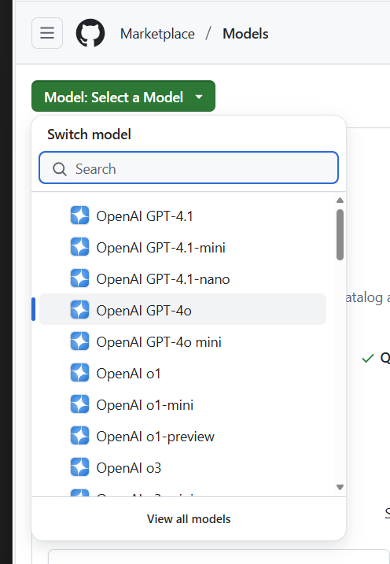
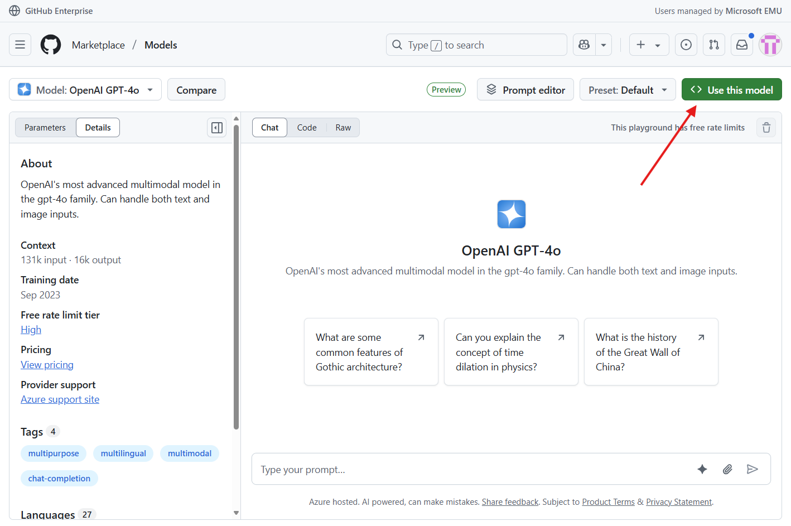
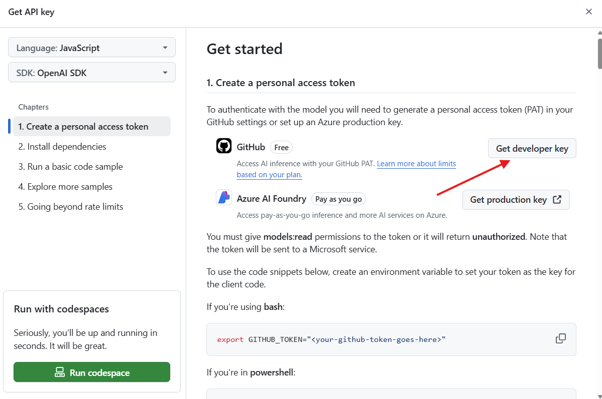
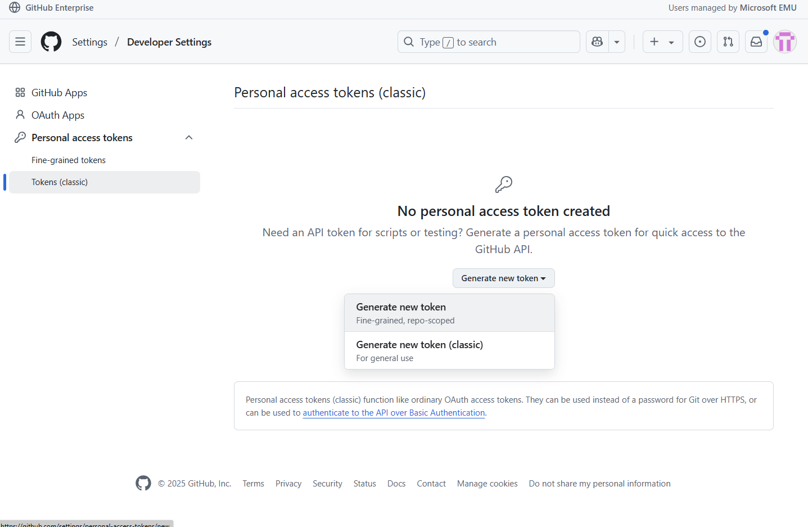
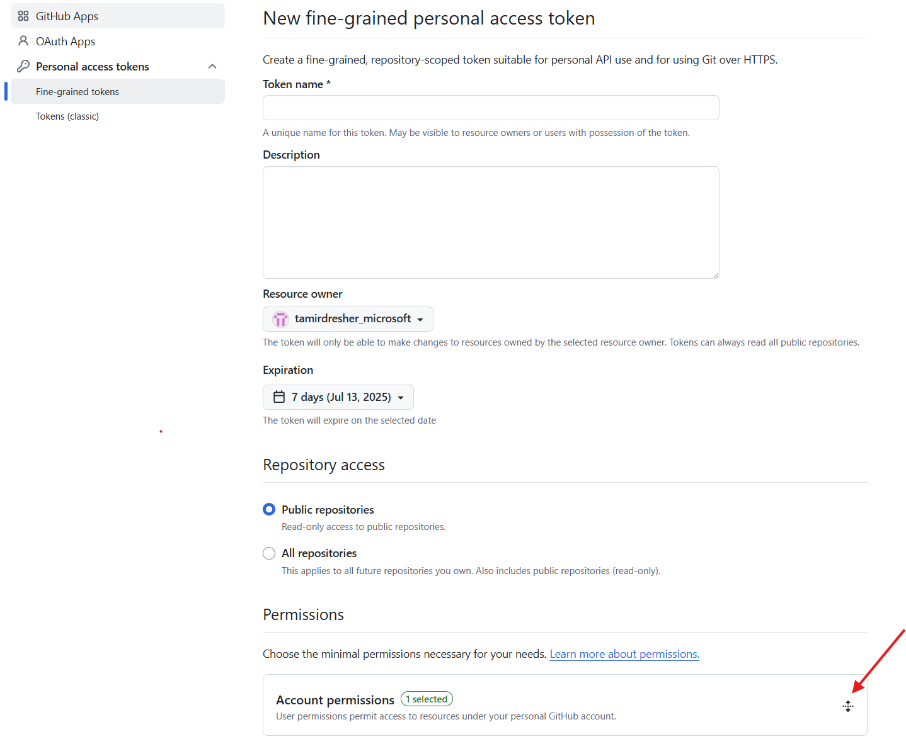
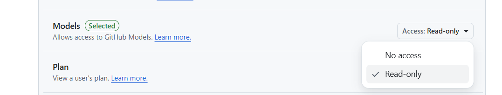
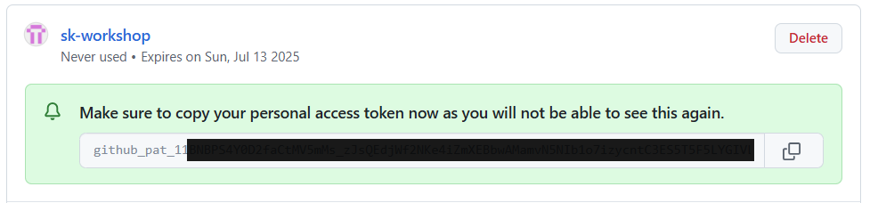
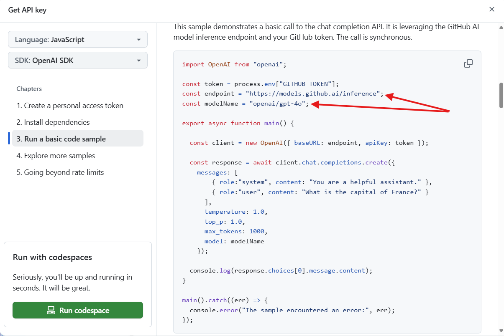

# Using GitHub hosted AI models in Semantic Kernel

1. Navigate to https://github.com/marketplace/models

2. Click on the "Select Model" button and select the model you'd like to use

3. Click on the "Use this model" button

4. Create a token by using clicking the "Get developer key" button

5. Click on the "Generate new token"

6. Fill the necessary information and then open the "Account permissions"

7. Enable the "Models" read-only premission

8. Generate the the token and copy the it (this will be your ApiKey)

9. Go back to the model Getting Started screen, and scroll to the code sample. Copy the endpoint and model name

